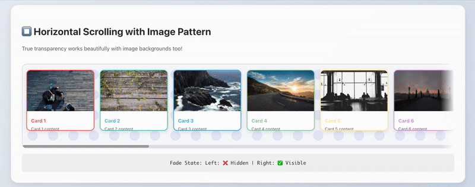
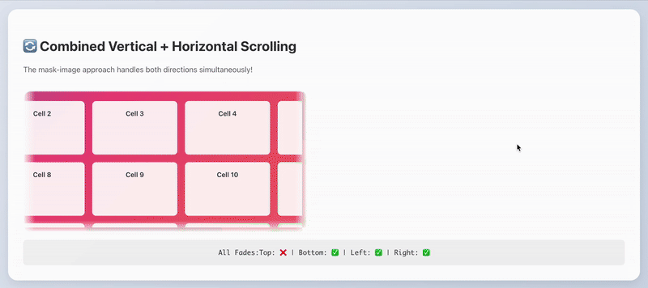

# use-scroll-fades

[](https://www.npmjs.com/package/@gboue/use-scroll-fades)
[](https://www.npmjs.com/package/@gboue/use-scroll-fades)

Library-agnostic React hook that adds **scroll-fade indicators** to any scrollable container. Supports both vertical and horizontal scrolling with smooth animations. No CSS frameworks, no runtime dependencies. Works with plain CSS-in-JS, inline styles, or your existing styling solution.

* **Vertical scrolling**: Top/bottom fades for vertical content
* **Horizontal scrolling**: Left/right fades for horizontal content  
* **🎨 Custom gradient colors**: Full control over fade colors and opacity
* **♿ Accessibility support**: Auto-respects `prefers-reduced-motion` and browser capabilities
* **Smart hiding**: Fades automatically hide at scroll edges
* **Smooth animations**: Built-in CSS transitions with cross-browser support
* **Interactive demos**: Live color picker and examples at [demo site](https://cosmicthreepointo.github.io/use-scroll-fades/)
* Zero external deps, React only
* Ships with TypeScript definitions

---

## Installation

```bash
# npm
npm i @gboue/use-scroll-fades
# or
yarn add @gboue/use-scroll-fades
# or
pnpm add @gboue/use-scroll-fades
```

Types are included. If you use JavaScript only, no extra step is required. If you prefer separate type installs in some setups, the package already contains `*.d.ts` files.

---

## Visual Examples

See the library in action with different scrolling scenarios at the official github page: https://cosmicthreepointo.github.io/use-scroll-fades/

### Vertical Scrolling with Gradient Background ✨


> ⚠️ **Top and bottom fades** that works perfectly with complex gradient backgrounds!

### Horizontal Scrolling with Image Pattern 🎨


> 🎨 **Left and right fades** work seamlessly with background images and patterns!

### Combined Vertical + Horizontal Scrolling 🚀


> 🚀 **All four fades** (top, bottom, left, right) work together automatically. No configuration needed!

---

## Quick Start (New Mask-Image Approach) ✨

The new mask-image approach provides **true transparency** that works with any background:

```tsx
import { useScrollFades } from '@gboue/use-scroll-fades'

function ScrollableList({ items }) {
  const { containerRef, getContainerStyle } = useScrollFades({
    threshold: 16,
    fadeSize: 20,
    transitionDuration: 300
  })

  return (
    <div 
      ref={containerRef}
      style={{
        height: '400px',
        overflow: 'auto',
        // Complex background that works perfectly with mask-image
        backgroundImage: 'linear-gradient(45deg, #ff6b6b, #4ecdc4)',
        ...getContainerStyle()
      }}
    >
      {items.map(item => (
        <div key={item.id} className="item">
          {item.name}
        </div>
      ))}
    </div>
  )
}
```

## 🎨 Gradient Color Customization (New!)

Customize the fade colors to match your design theme with the new gradient color API:

### Simple Color Override
```tsx
import { useScrollFades } from '@gboue/use-scroll-fades'

function ColoredScrollableList({ items }) {
  const { 
    containerRef, 
    getContainerStyle,
    getGradientProperties,
    getColoredFadeClass
  } = useScrollFades({
    fadeColor: 'rgba(0, 122, 255, 0.3)', // Blue fade matching your theme
    threshold: 16,
    fadeSize: 24
  })

  return (
    <div 
      ref={containerRef}
      className={getColoredFadeClass()} // Add colored fade support
      style={{
        height: '400px',
        overflow: 'auto',
        background: 'linear-gradient(135deg, #667eea, #764ba2)',
        ...getContainerStyle(),
        ...getGradientProperties() // Apply colored gradients
      }}
    >
      {items.map(item => <div key={item.id}>{item.name}</div>)}
    </div>
  )
}
```

### Individual Direction Colors
```tsx
import { useScrollFades } from '@gboue/use-scroll-fades'

function CustomGradientList({ items }) {
  const { 
    containerRef, 
    getContainerStyle,
    getGradientProperties,
    getColoredFadeClass
  } = useScrollFades({
    topColors: { from: 'rgba(255, 0, 0, 0.4)', to: 'transparent' },
    bottomColors: { from: 'rgba(0, 255, 0, 0.4)', to: 'transparent' },
    leftColors: { from: 'rgba(0, 0, 255, 0.4)', to: 'transparent' },
    rightColors: { from: 'rgba(255, 255, 0, 0.4)', to: 'transparent' }
  })

  return (
    <div 
      ref={containerRef}
      className={getColoredFadeClass()}
      style={{
        height: '400px',
        overflow: 'auto',
        ...getContainerStyle(),
        ...getGradientProperties()
      }}
    >
      {items.map(item => <div key={item.id}>{item.name}</div>)}
    </div>
  )
}
```

### Advanced Custom Color Example (Overlay Method)
For complex scenarios where you need full control over positioning and effects:

```tsx
import React, { useRef, useEffect } from 'react';
import { useScrollFades } from '@gboue/use-scroll-fades';

function AdvancedColorFadeList({ items }) {
  const { containerRef, state } = useScrollFades({
    threshold: 8,
    fadeSize: 50,
    transitionDuration: 300
  });

  const topFadeRef = useRef(null);
  const bottomFadeRef = useRef(null);

  // Custom colors with opacity
  const topColor = 'rgba(255, 69, 0, 0.2)';    // Orange fade
  const bottomColor = 'rgba(0, 128, 255, 0.2)'; // Blue fade

  // Position overlays to match container
  useEffect(() => {
    const updatePositions = () => {
      if (!containerRef.current) return;
      
      const rect = containerRef.current.getBoundingClientRect();
      const style = window.getComputedStyle(containerRef.current);
      
      if (topFadeRef.current) {
        topFadeRef.current.style.top = `${rect.top}px`;
        topFadeRef.current.style.left = `${rect.left}px`;
        topFadeRef.current.style.width = `${rect.width}px`;
        topFadeRef.current.style.borderRadius = style.borderRadius;
      }
      
      if (bottomFadeRef.current) {
        bottomFadeRef.current.style.bottom = `${window.innerHeight - rect.bottom}px`;
        bottomFadeRef.current.style.left = `${rect.left}px`;
        bottomFadeRef.current.style.width = `${rect.width}px`;
        bottomFadeRef.current.style.borderRadius = style.borderRadius;
      }
    };

    updatePositions();
    const interval = setInterval(updatePositions, 100);
    
    return () => clearInterval(interval);
  }, []);

  return (
    <div style={{ position: 'relative' }}>
      <div 
        ref={containerRef}
        style={{
          height: '400px',
          overflow: 'auto',
          background: '#ffffff',
          borderRadius: '16px',
          border: '1px solid #e2e8f0'
        }}
      >
        {items.map(item => (
          <div key={item.id} style={{ padding: '1rem', margin: '1rem' }}>
            {item.content}
          </div>
        ))}
      </div>

      {/* Colored fade overlays */}
      <div 
        ref={topFadeRef}
        style={{
          position: 'fixed',
          height: '50px',
          background: `linear-gradient(to bottom, ${topColor}, transparent)`,
          display: state.showTop ? 'block' : 'none',
          pointerEvents: 'none',
          zIndex: 10
        }}
      />
      <div 
        ref={bottomFadeRef}
        style={{
          position: 'fixed',
          height: '50px',
          background: `linear-gradient(to top, ${bottomColor}, transparent)`,
          display: state.showBottom ? 'block' : 'none',
          pointerEvents: 'none',
          zIndex: 10
        }}
      />
    </div>
  );
}
```

### Interactive Demo
Try the live interactive color picker demo at: https://cosmicthreepointo.github.io/use-scroll-fades/

### Legacy Overlay Approach (Deprecated)

For backward compatibility, the overlay approach is still available but deprecated:

```tsx
import { useScrollFades } from '@gboue/use-scroll-fades'

function LegacyScrollableList({ items }) {
  const { containerRef, state, getOverlayStyle } = useScrollFades({
    threshold: 16,
    transitionDuration: 300
  })

  return (
    <div style={{ position: 'relative' }}>
      <div 
        ref={containerRef}
        style={{ height: '400px', overflow: 'auto' }}
      >
        {items.map(item => (
          <div key={item.id}>{item.name}</div>
        ))}
      </div>
      
      {/* Overlay elements - only work well on solid backgrounds */}
      <div 
        style={{
          position: 'absolute',
          top: 0,
          left: 0,
          right: 0,
          height: '20px',
          ...getOverlayStyle('top')
        }}
      />
      <div 
        style={{
          position: 'absolute',
          bottom: 0,
          left: 0,
          right: 0,
          height: '20px',
          ...getOverlayStyle('bottom')
        }}
      />
    </div>
  )
}
```

## Why Mask-Image is Superior ✨

### ✅ New Mask-Image Approach (Recommended)
- **🎨 True transparency**: Works perfectly with any background (images, gradients, patterns)
- **🚀 Better performance**: GPU-accelerated mask properties, fewer DOM elements  
- **📐 Simpler markup**: Apply styles directly to the scrollable container
- **🔧 Cleaner CSS**: Uses modern CSS mask properties
- **🌐 Cross-browser**: Includes WebKit prefixes for Safari support
- **⚡ Future-proof**: Modern CSS approach that will improve over time

### ❌ Old Overlay Approach (Deprecated)  
- **🎯 Limited backgrounds**: Only works well on solid colors
- **💔 Visual artifacts**: Creates muddy, layered effects on complex backgrounds
- **📦 More DOM elements**: Requires separate positioned overlay divs
- **🔧 Positioning complexity**: Absolute positioning can be tricky to maintain
- **🐛 Z-index issues**: Can interfere with other content

## Real-World Examples

### Complex Gradient Background ✨
```tsx
// This would look terrible with overlay gradients!
<div 
  ref={containerRef}
  style={{
    height: '400px',
    overflow: 'auto',
    backgroundImage: 'linear-gradient(135deg, #667eea 0%, #764ba2 50%, #f093fb 100%)',
    ...getContainerStyle() // ✅ Perfect transparency with mask-image!
  }}
>
  {/* Your scrollable content */}
</div>
```

### Image/Pattern Backgrounds ✨
```tsx
// Pattern backgrounds work beautifully!
<div 
  ref={containerRef}
  style={{
    overflow: 'auto',
    backgroundImage: 'url("your-pattern.svg")',
    backgroundColor: '#f8fafc',
    ...getContainerStyle() // ✅ True transparency shows the pattern perfectly!
  }}
>
  {/* Your content */}
</div>
```

### Combined Vertical + Horizontal Scrolling ✨

The mask-image approach automatically handles both vertical and horizontal scrolling simultaneously - no configuration needed!

## Browser Support

The package works in all modern browsers with full support for both mask-image and overlay approaches:

### ✅ Mask-Image Approach (Recommended)
- **Chrome 120+** - Full mask-image support
- **Firefox 53+** - Full mask-image support  
- **Safari 15.4+** - Full mask-image support with WebKit prefixes
- **Edge 79+** - Full mask-image support

### ✅ Legacy Overlay Approach (Fallback)
- **Chrome 26+** (2013+) - Full animation support
- **Firefox 16+** (2012+) - Full animation support
- **Safari 9+** (2015+) - Full animation support
- **Edge 12+** (2015+) - Full animation support
- **iOS Safari 9+** (2015+) - Full animation support
- **Android Chrome 26+** (2013+) - Full animation support

### 🔧 Graceful Degradation
- **Internet Explorer 11** - Overlay approach works, no smooth transitions
- **Older browsers** - Falls back to instant show/hide, maintains scrolling functionality

For browsers without mask-image support, the hook automatically falls back to the overlay approach or gracefully degrades to no fade effects while maintaining full scrolling functionality.

### Technical Details

The animations use CSS `opacity` transitions with vendor prefixes for maximum compatibility:
```css
transition: opacity 200ms ease-out;
-webkit-transition: opacity 200ms ease-out; /* Safari */
-moz-transition: opacity 200ms ease-out;    /* Firefox */
-ms-transition: opacity 200ms ease-out;     /* IE/Edge */
```

**Performance optimized:**
- Uses `opacity` (GPU-accelerated) instead of `display` changes
- `pointer-events: none` prevents interaction overhead  
- `requestAnimationFrame` for smooth scroll handling
- `ResizeObserver` and `MutationObserver` for efficient updates

**Accessibility features:**
- `aria-hidden="true"` on overlay elements
- Respects `prefers-reduced-motion` when you disable transitions
- No interference with keyboard navigation or screen readers

## Horizontal Scrolling

Both approaches support horizontal scrolling:

```tsx
const { containerRef, getContainerStyle } = useScrollFades({
  threshold: 12,
  fadeSize: 24
})

return (
  <div 
    ref={containerRef}
    style={{
      width: '400px',
      height: '200px',
      overflow: 'auto',
      ...getContainerStyle()
    }}
  >
    <div style={{ width: '800px', height: '100px' }}>
      Wide content that scrolls horizontally
    </div>
  </div>
)
```

## Configuration Options

```ts
export type FadeState = { 
  showTop: boolean,    // Vertical scroll: top fade visibility
  showBottom: boolean, // Vertical scroll: bottom fade visibility  
  showLeft: boolean,   // Horizontal scroll: left fade visibility
  showRight: boolean   // Horizontal scroll: right fade visibility
}

export type GradientColors = {
  from: string // Start color (solid edge), default 'rgba(0,0,0,0.15)'
  to: string   // End color (fade to transparent), default 'transparent'
}

export type UseScrollFadesOptions = {
  // Basic configuration
  threshold?: number // px edge tolerance, default 8
  fadeSize?: number // Size of fade effect in pixels, default 20
  // 🎨 NEW: Gradient color customization
  fadeColor?: string // Single color for all directions, overrides individual colors
  topColors?: GradientColors // Custom gradient colors for top fade
  bottomColors?: GradientColors // Custom gradient colors for bottom fade
  leftColors?: GradientColors // Custom gradient colors for left fade
  rightColors?: GradientColors // Custom gradient colors for right fade
  // Legacy overlay gradients (deprecated)
  topGradient?: string // CSS gradient for the top overlay
  bottomGradient?: string // CSS gradient for the bottom overlay
  leftGradient?: string // CSS gradient for the left overlay
  rightGradient?: string // CSS gradient for the right overlay
  // Animation options
  transitionDuration?: number // Fade transition duration in ms, default 200
  transitionTimingFunction?: string // CSS timing function, default 'ease-out'
  disableTransitions?: boolean // Disable animations, default false
  // Accessibility and browser support
  respectReducedMotion?: boolean // Auto-respect prefers-reduced-motion, default true
  respectBrowserSupport?: boolean // Disable if mask-image unsupported, default true
  maskImageFallback?: 'disable' | 'ignore' // Fallback behavior, default 'disable'
}

export function useScrollFades<T extends HTMLElement = HTMLElement>(
  options?: UseScrollFadesOptions
): {
  containerRef: React.RefObject<T>
  state: FadeState
  /**
   * ✨ PRIMARY: Get styles for the scrollable container with mask-based fades
   * Creates true transparency that works with any background!
   */
  getContainerStyle: (state?: FadeState) => React.CSSProperties
  /**
   * 🚫 DEPRECATED: Legacy overlay approach for backward compatibility
   * Use getContainerStyle() instead - it's better in every way!
   */
  getOverlayStyle: (
    position: 'top' | 'bottom' | 'left' | 'right',
    state?: FadeState
  ) => React.CSSProperties
  /**
   * 🎨 NEW: Get CSS custom properties for colored gradient fades
   * Use with getColoredFadeClass() for colored fade effects
   */
  getGradientProperties: (state?: FadeState) => Record<string, string>
  /**
   * 🎨 NEW: Get CSS class name for colored fades
   * Add this class to your container along with getContainerStyle()
   */
  getColoredFadeClass: () => string
  /**
   * 🔧 Accessibility and browser compatibility information
   */
  accessibility: {
    shouldApplyEffects: boolean // Whether effects are enabled based on user prefs
    reducedMotionPreferred: boolean // User's motion preference state
    browserCapabilities: object // Detailed browser capability detection
    shouldDisableTransitions: boolean // Whether transitions should be disabled
  }
}
```

### Notes

* **Agnostic**: The hook returns state and a small helper. You are free to style overlays with CSS classes, CSS modules, styled components, etc. The gradients are plain CSS strings you can override.
* **Accessibility**: Automatically respects `prefers-reduced-motion` and checks browser support for graceful degradation.
* **Performance**: Uses `requestAnimationFrame`, `ResizeObserver`, and `MutationObserver` to stay accurate during resizes and dynamic content changes without jank.
* **Smooth Animations**: Built-in CSS transitions provide smooth fade in/out effects with cross-browser support.

---

## ♿ Accessibility & Browser Support

The library automatically respects user accessibility preferences and browser capabilities:

### Accessibility Features

- **🎯 `prefers-reduced-motion` Support**: Automatically disables transitions when users prefer reduced motion
- **🌐 Browser Detection**: Checks for CSS `mask-image` support before applying effects
- **⚡ Progressive Enhancement**: Falls back gracefully in unsupported browsers
- **🔧 Manual Control**: Override automatic behavior when needed

```tsx
function AccessibleScrollList() {
  const { containerRef, getContainerStyle, accessibility } = useScrollFades({
    respectReducedMotion: true,      // Default: true - respects user preference
    respectBrowserSupport: true,     // Default: true - checks browser capabilities  
    maskImageFallback: 'disable'    // Default: 'disable' - what to do if unsupported
  })
  
  // Access detailed accessibility information
  console.log(accessibility.shouldApplyEffects)      // false if user prefers reduced motion
  console.log(accessibility.reducedMotionPreferred)  // current user preference
  console.log(accessibility.browserCapabilities)     // detailed browser info
  console.log(accessibility.shouldDisableTransitions) // whether transitions are disabled

  return (
    <div 
      ref={containerRef}
      style={{
        height: '300px',
        overflow: 'auto',
        ...getContainerStyle()  // Will be empty if effects should not apply
      }}
    >
      {/* Your content */}
    </div>
  )
}
```

### Browser Compatibility

**✅ Full Support**:
- Chrome 120+ (mask-image stable)
- Firefox 53+ (mask-image stable)
- Safari 15.4+ (mask-image stable)
- Edge 79+ (Chromium-based)

**⚠️ Partial Support**:
- Safari 3.1+ (with `-webkit-` prefix)
- Legacy browsers: Falls back gracefully (no effects, no errors)

**🔧 Manual Feature Detection**:
```tsx
import { supportsMaskImage, prefersReducedMotion } from '@gboue/use-scroll-fades'

// Check browser capabilities manually
if (supportsMaskImage()) {
  console.log('Mask-image is supported!')
}

if (prefersReducedMotion()) {
  console.log('User prefers reduced motion')
}
```

### Configuration Options

| Option | Type | Default | Description |
|--------|------|---------|-------------|
| `respectReducedMotion` | `boolean` | `true` | Automatically respect `prefers-reduced-motion: reduce` |
| `respectBrowserSupport` | `boolean` | `true` | Disable effects if `mask-image` is not supported |
| `maskImageFallback` | `'disable' \| 'ignore'` | `'disable'` | What to do when mask-image is unsupported |

---

## Animation Options

The hook includes smooth fade animations by default. You can customize or disable them:

```tsx
import { useScrollFades } from '@gboue/use-scroll-fades'

// Default smooth animations (200ms ease-out)
const { containerRef, state, getOverlayStyle } = useScrollFades()

// Custom animation timing
const customAnimated = useScrollFades({
  transitionDuration: 300, // 300ms duration
  transitionTimingFunction: 'ease-in-out' // Custom easing
})

// Faster animations
const quickFades = useScrollFades({
  transitionDuration: 100, // Snappy 100ms
  transitionTimingFunction: 'ease-out'
})

// Disable animations entirely
const noAnimations = useScrollFades({
  disableTransitions: true // Instant show/hide
})

// Custom CSS transitions (for advanced users)
const advancedAnimations = useScrollFades({
  transitionTimingFunction: 'cubic-bezier(0.4, 0, 0.2, 1)' // Material Design easing
})
```

### Supported CSS Timing Functions

All standard CSS timing functions are supported across modern browsers:
- `ease`, `ease-in`, `ease-out`, `ease-in-out` 
- `linear`
- `cubic-bezier(n,n,n,n)` for custom curves
- `steps(n, start|end)` for stepped animations

---

## Advanced Usage

### Custom Styling with CSS Classes

```tsx
import React from 'react'
import { useScrollFades } from '@gboue/use-scroll-fades'
import './ScrollFades.css' // Your custom CSS

export default function CustomStyledList({ items }) {
  const { containerRef, state } = useScrollFades({ threshold: 16 })

  return (
    <div className="scroll-container">
      <div ref={containerRef} className="scrollable-content">
        {items.map((item, i) => (
          <div key={i} className="list-item">{item}</div>
        ))}
      </div>
      
      {/* Custom CSS classes instead of inline styles */}
      <div className={`fade-overlay fade-top ${state.showTop ? 'visible' : 'hidden'}`} />
      <div className={`fade-overlay fade-bottom ${state.showBottom ? 'visible' : 'hidden'}`} />
    </div>
  )
}
```

### With Styled Components

```tsx
import React from 'react'
import styled from 'styled-components'
import { useScrollFades } from '@gboue/use-scroll-fades'

const Container = styled.div`
  position: relative;
  max-width: 640px;
`

const ScrollableArea = styled.div`
  overflow: auto;
  height: 300px;
  background: white;
  border-radius: 8px;
`

const FadeOverlay = styled.div<{ $visible: boolean; $position: 'top' | 'bottom' }>`
  position: absolute;
  left: 0;
  right: 0;
  height: 40px;
  pointer-events: none;
  opacity: ${props => props.$visible ? 1 : 0};
  transition: opacity 0.2s ease;
  
  ${props => props.$position === 'top' ? `
    top: 0;
    background: linear-gradient(to bottom, rgba(255,255,255,0.9), transparent);
  ` : `
    bottom: 0;
    background: linear-gradient(to top, rgba(255,255,255,0.9), transparent);
  `}
`

export default function StyledList({ items }) {
  // Note: Hook provides built-in smooth transitions
  // But you can also use styled-components transitions as shown above
  const { containerRef, state, getOverlayStyle } = useScrollFades({ 
    threshold: 10,
    transitionDuration: 250 // Slightly slower for demo
  })

  return (
    <Container>
      <ScrollableArea ref={containerRef}>
        {items.map((item, i) => <div key={i}>{item}</div>)}
      </ScrollableArea>
      
      {/* Option 1: Use hook's built-in animations */}
      <div style={{
        position: 'absolute', left: 0, right: 0, top: 0, height: 40,
        pointerEvents: 'none',
        ...getOverlayStyle('top')
      }} />
      <div style={{
        position: 'absolute', left: 0, right: 0, bottom: 0, height: 40,
        pointerEvents: 'none', 
        ...getOverlayStyle('bottom')
      }} />
      
      {/* Option 2: Or use styled-components animations */}
      {/* <FadeOverlay $visible={state.showTop} $position="top" />
      <FadeOverlay $visible={state.showBottom} $position="bottom" /> */}
    </Container>
  )
}
```

### Virtualized Lists (React Window)

```tsx
import React from 'react'
import { FixedSizeList as List } from 'react-window'
import { useScrollFades } from '@gboue/use-scroll-fades'

export default function VirtualizedList({ items }) {
  const { containerRef, state, getOverlayStyle } = useScrollFades()

  return (
    <div style={{ position: 'relative', height: 400, width: 300 }}>
      <List
        ref={containerRef}
        height={400}
        itemCount={items.length}
        itemSize={50}
      >
        {({ index, style }) => (
          <div style={style}>
            {items[index]}
          </div>
        )}
      </List>
      
      <div aria-hidden style={{
        ...getOverlayStyle('top', state),
        position: 'absolute', top: 0, left: 0, right: 0, height: 30
      }} />
      <div aria-hidden style={{
        ...getOverlayStyle('bottom', state),
        position: 'absolute', bottom: 0, left: 0, right: 0, height: 30
      }} />
    </div>
  )
}
```

---

## Accessibility Tips

* Keep overlays `aria-hidden` so screen readers ignore them
* Avoid placing tabbable elements inside fade overlays
* Consider adding `aria-live` status text like "More content below" if your UX requires it
* Test with keyboard navigation to ensure overlays don't interfere

---

## Performance Tips

* The hook automatically throttles scroll events using `requestAnimationFrame`
* `ResizeObserver` and `MutationObserver` ensure fades update when content changes
* State updates are optimized to prevent unnecessary re-renders
* No external dependencies means smaller bundle size

---

## FAQ

**Does it work without any CSS library?**  
Yes. The hook returns state plus `getOverlayStyle`. You can replace those inline styles with your own classes if you prefer.

**Can I use it in virtualized lists (e.g., React Window)?**  
Yes. Attach `containerRef` to the scrollable viewport element and it will work the same.

**Is SSR supported?**  
Yes. The hook only touches DOM APIs inside `useEffect`, so it's safe on the server; fades initialize on the client.

**How do I theme the gradients?**  
Override `topGradient` and `bottomGradient` with any valid CSS gradient or image.

**Does it support horizontal scrolling?**  
Yes! Supports both vertical and horizontal scrolling automatically with the mask-image approach. No configuration needed!

**How do I migrate from overlay to mask-image approach?**  
Simple! Replace `getOverlayStyle()` overlays with `getContainerStyle()` applied directly to your container:

```tsx
// OLD overlay approach ❌
<div style={{ position: 'relative' }}>
  <div ref={containerRef} style={{ overflow: 'auto' }}>
    {content}
  </div>
  <div style={{ position: 'absolute', top: 0, ...getOverlayStyle('top') }} />
  <div style={{ position: 'absolute', bottom: 0, ...getOverlayStyle('bottom') }} />
</div>

// NEW mask-image approach ✅  
<div ref={containerRef} style={{ overflow: 'auto', ...getContainerStyle() }}>
  {content}
</div>
```

**What React versions are supported?**  
React 16.8+ (hooks support). Tested with React 17, 18, and 19.

**Can I use it with CSS-in-JS libraries?**  
Absolutely. The hook is styling-agnostic - use it with styled-components, emotion, or any CSS solution.

---

## Contributing

Issues and pull requests are welcome! Please ensure tests pass before submitting.

```bash
# Development setup
npm install
npm run test
npm run build
```

---

## License

MIT
